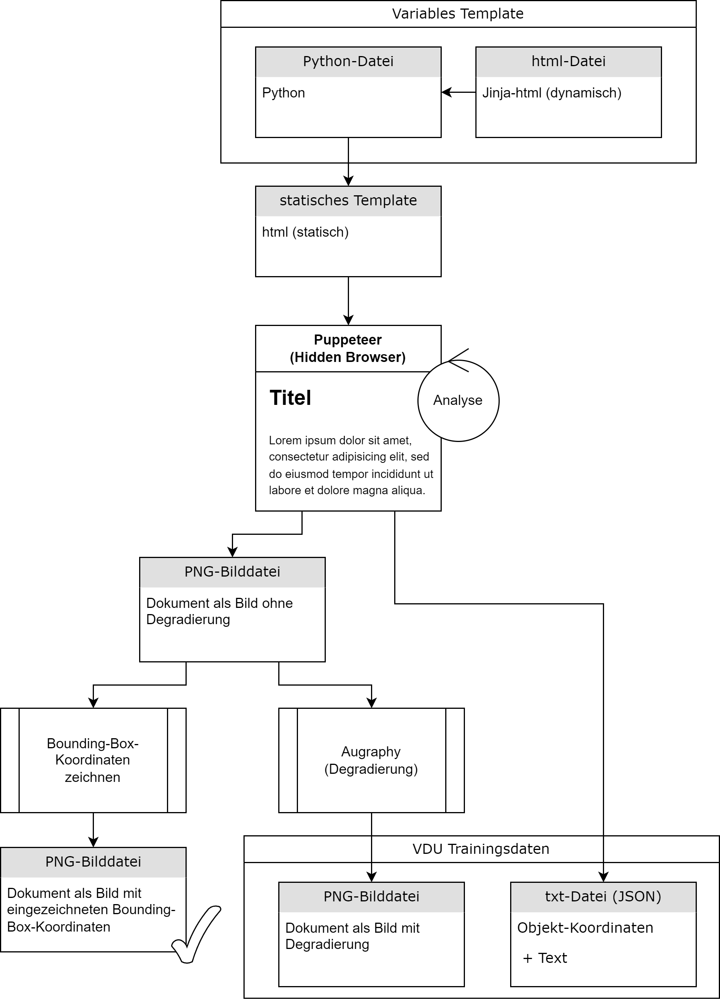

# Projektinstallation

## Voraussetzungen

- [Python 3.10.0](https://www.python.org/downloads/release/python-3100/) muss installiert sein.
- [Node.js und npm](https://nodejs.org/en/download/) müssen installiert sein.

## Installation

1. Entpacken Sie die `doc-gen.zip`-Datei.
2. Öffnen Sie eine Eingabeaufforderung (CMD) oder PowerShell im entpackten Verzeichnis.
3. Installieren Sie die Node.js-Abhängigkeiten:

    ```sh
    npm install
    ```

4. Erstellen Sie eine virtuelle Umgebung und installieren Sie die Python-Abhängigkeiten:

    ```sh
    python -m venv docgen_env
    docgen_env\Scripts\activate
    pip install -r requirements.txt
    ```

5. Nach der Installation der Abhängigkeiten können Sie das Hauptskript `Doc-Gen-starten.py` ausführen, um sicherzustellen, dass alles funktioniert:

    ```sh
    docgen_env\Scripts\activate
    python DokumentGenerator\Doc-Gen-starten.py
    ```

    Dieses Skript startet den Dokumentgenerator und überprüft, ob alle erforderlichen Skripte ordnungsgemäß funktionieren.


# Projektstruktur

Dies ist die Verzeichnisstruktur für das Projekt `doc-gen`:

```plaintext
doc-gen/
├── augraphy_cache/                         # Zwischenspeicher für Bilddegradierung
│   ├── image_0.png
│   ├── image_1.png
│   ├── ...
│   └── image_X.png
├── bb-erfassen-output/                     # Ausgabe der Bounding-Box-Erfassung (JSON und YOLO)
├── data_for_yolo/                          # Trainingsdaten für YOLO-Modell
├── docgen_env/                             # Virtuelle Umgebung für den Dokumentengenerator
├── DokumentGenerator/                      # Hauptverzeichnis des Dokumentgenerators
│   ├── fonts/                              # Verzeichnis für Schriftarten
│   │   └── Corona-3-Typewriter.ttf
│   ├── bb-erfassen-output/                 # Verzeichnis für die Ausgabe von Bounding Box-Daten
│   │   ├── *.txt                           # Bounding Box-Daten im YOLO-Format
│   │   └── *.json                          # JSON-Dateien mit Bounding Box-Koordinaten
│   ├── output/                             # Ordner für die Ausgabe generierter Dokumente
│   ├── templates/                          # Vorlagen für die Dokumentengenerierung
│   ├── alle-JSON-bb-zeichnen.py            # Skript zum Zeichnen von Bounding Boxes aus JSON-Dateien
│   ├── alle-JSON-to-YOLO.py                # Skript zur Konvertierung von JSON Bounding Boxes zu YOLO-Format
│   ├── alleTemplatesGenerieren.py          # Skript zur Generierung von Dokumenten aus Vorlagen
│   ├── alle-YOLO-bb-zeichnen.py            # Skript zum Zeichnen von Bounding Boxes im YOLO-Format
│   ├── augraphy_augmentation.py            # Skript für Bilddegradierungsprozesse mit Augraphy
│   ├── Doc-Gen-starten.py                  # Hauptskript zum Starten des Dokumentgenerators
│   └── html-to-png+bb-analyse.js           # Skript zur Konvertierung von HTML zu PNG und zur Bounding Box-Analyse
├── node_modules/                           # Node.js Module
├── output/                                 # Ausgabeverzeichnis für generierte Dokumente
├── Puppeteer/                              # Puppeteer-Scripts und Einstellungen
├── static/                                 # Statische Dateien für Web-Vorlagen
│   ├── images/                             # Verzeichnis für Bilder
│   │   ├── bueroklammern/                  # Verzeichnis für Büroklammern-Bilder
│   │   │   ├── Klammer (1).png
│   │   │   ├── Klammer (2).png
│   │   │   ├── ...
│   │   │   └── Klammer (16).png
│   │   ├── paper_textures/                 # Verzeichnis für Papiertexturen
│   │   │   ├── 2.jpg
│   │   │   ├── 3.jpg
│   │   │   ├── ...
│   │   │   └── 52.jpg
│   │   └── stempel/                        # Verzeichnis für Stempel-Bilder
│   │       ├── stempel (1).png
│   │       ├── stempel (2).png
│   │       ├── ...
│   │       ├── stempel (90).png
│   │       └── unten_mittig/               # Verzeichnis für unten mittig platzierte Stempel-Bilder
│   │           ├── stempel_unten_mittig (1).png
│   │           ├── stempel_unten_mittig (2).png
│   │           ├── ...
│   │           └── stempel_unten_mittig (49).png
├── .prettierrc                             # Konfigurationsdatei für Prettier
├── package.json                            # NPM Paketverwaltungsdatei
├── package-lock.json                       # NPM Paketsperrdatei für genaue Modulversionen
├── readme.md                               # Projektbeschreibung und Anleitung
└── requirements.txt                        # Python-Abhängigkeiten


```

### Beschreibung der wichtigsten Skripte und Verzeichnisse

#### *Doc-Gen-starten.py*
Dieses Skript ist das Hauptskript zum Starten des Dokumentgenerators. Es steuert die Ausführung mehrerer anderer Skripte, die für die Generierung und Verarbeitung der Dokumenten erforderlich sind. Hier sind die Hauptfunktionen und -aufgaben dieses Skripts:

- **Ausführung der Skripte**: Die Liste der Dokumententstehungsprozesses nacheinander ausgeführt. Die ausgeführten Skripte umfassen:
  - *alleTemplatesGenerieren.py*: Konvertiert Jinja-HTML-Dateien in statische HTML-Dateien, in dem jede Python-Datei eines jeden Templates einmal ausgeführt wird.
  - *html-to-png+bb-analyse.js*: Konvertiert statische HTML-Dateien in PNG-Dateien und analysiert die Bounding-Boxes der Dokumentobjekte
  - *alle-JSON-bb-zeichnen.py*: Zeichnet Bounding-Boxes in die PNG-Dateien für eine Visuelle Kontrolle
  - *augraphy_augmentation.py*: Augmentiert bzw. degradiert die Bilder.
  - *alle-JSON-to-YOLO.py*: Konvertiert die JSON-Koordinaten der Bounding-Boxes in das YOLO-Format.
  - *alle-YOLO-bb-zeichnen.py*: Zeichnet die YOLO-Koordinaten der Bounding-Boxes in die PNG-Dateien für eine Visuelle Kontrolle


#### *bb-erfassen-output/*
Dieses Verzeichnis enthält Bounding Box-Daten im YOLO-Format als `.txt`-Dateien sowie die Bounding Box-Koordinaten als `.json`-Dateien. Diese Daten sind kritisch für Trainingsprozesse und die Validierung der Bounding Box-Erkennung.

#### *alle-JSON-bb-zeichnen.py*
Dieses Skript liest Bounding Box-Informationen aus JSON-Dateien und visualisiert diese auf den entsprechenden Bildern. Dies ist nützlich zur Überprüfung und Fehlerbehebung der Bounding Box-Detektion.

#### *alle-JSON-to-YOLO.py*
Dieses Skript konvertiert Bounding Box-Daten von einem JSON-Format in das YOLO-Format. Diese Umwandlung ist essenziell für die Nutzung der Daten in YOLO-basierten maschinellen Lernmodellen.

#### *alleTemplatesGenerieren.py*
Ein Automationsskript, das aus den Vorlagen im *templates/* Verzeichnis fertige Dokumente generiert. Dieser Prozess ist zentral für die Simulierung von realen Dokumenten, die in Trainingsdatensätzen verwendet werden.

#### *augraphy_augmentation.py*
Ein Skript, das Bilddegradierungstechniken auf generierte Dokumente anwendet, um realistischere Trainingsdaten zu erzeugen. Dies verbessert die Robustheit des trainierten Modells gegenüber Variationen in Eingabedokumenten. Eine Liste der möglichen Effekte finden Sie [hier](https://augraphy.readthedocs.io/en/latest/doc/source/list_of_augmentations.html).

Tipp: Manche Effekte verändern die Abmessungen des Bildes geringfügig, falls es wichtig sein sollte, immer die gleichen Abmessungen der Trainingsdokumente zu haben. Allerdings nicht mit den aktuellen Effekten in diesem Skript.

#### *html-to-png+bb-analyse.js*
Dieses Skript ist ein wesentliches Werkzeug zur Konvertierung von HTML-Dateien in PNG-Bilder und zur Erfassung der Bounding Box-Koordinaten von Elementen innerhalb der HTML-Seiten. Hierbei wird Puppeteer verwendet, eine Node.js-Bibliothek, die Headless Chrome oder Chromium steuert, um verschiedene Web-Aktionen durchzuführen.

Der Prozess beginnt mit der Definition von Import- und Exportpfaden sowie der Festlegung von Abmessungen für A4-Seiten bei einer Auflösung von 300 DPI. Ein entscheidender Bestandteil des Skripts ist die `captureBoundingBoxesAndText`-Funktion, die die Bounding Box-Koordinaten und Texte von HTML-Elementen anhand eines definierten CSS-Selektors erfasst.

Der `const selector` in diesem Skript ist flexibel anpassbar, sodass Sie beliebige CSS-Selektoren hinzufügen oder entfernen können, um genau die Elemente zu analysieren, die für Ihre Dokumente relevant sind. Dies ermöglicht eine präzise und maßgeschneiderte Erfassung der Bounding Box-Daten für verschiedene Elemente wie Überschriften, Absätze, Bilder und andere HTML-Komponenten.

Das Skript liest HTML-Dateien aus einem definierten Verzeichnis, lädt diese in Puppeteer, skaliert den Inhalt für eine genauere Erfassung, und nimmt schließlich Screenshots der Seiten im PNG-Format. Gleichzeitig werden die Bounding Box-Daten der relevanten Elemente als JSON-Dateien gespeichert. Diese Daten können später für verschiedene Zwecke wie das Training von Machine-Learning-Modellen oder die visuelle Überprüfung genutzt werden.

Ein weiterer Vorteil dieses Skripts ist die Möglichkeit, bestehende Dateien im Ausgabeordner vor der neuen Verarbeitung zu löschen, um sicherzustellen, dass nur aktuelle Daten vorhanden sind. Dies macht das Skript zu einem effizienten und effektiven Werkzeug für die Dokumentenanalyse und Bildverarbeitung in Ihrem Projekt.


## Projektstruktur

- `DokumentGenerator/`:
  - `fonts/`: Verzeichnis für Schriftarten.
  - `bb-erfassen-output/`: Verzeichnis für die Ausgabe von Bounding Box-Daten.
    - `*.txt`: Bounding Box-Daten im YOLO-Format.
    - `*.json`: JSON-Dateien mit Bounding Box-Koordinaten.
  - `output/`: Ordner für die Ausgabe generierter Dokumente.
  - `templates/`: Vorlagen für die Dokumentengenerierung.
    - `fertigeHTML-Dokumente/`: Ordner für die generierten statischen HTML-Dateien.
    - `Template-Zwischenspeicher/`: Verzeichnis, das als Zwischenspeicher für aktuell nicht benötigte Templates dient.
  - `alle-JSON-bb-zeichnen.py`: Skript zum Zeichnen von Bounding Boxes aus JSON-Dateien.
  - `alle-JSON-to-YOLO.py`: Skript zur Konvertierung von JSON Bounding Boxes zu YOLO-Format.
  - `alleTemplatesGenerieren.py`: Skript zur Generierung von Dokumenten aus Vorlagen.
  - `alle-YOLO-bb-zeichnen.py`: Skript zum Zeichnen von Bounding Boxes im YOLO-Format.
  - `augraphy_augmentation.py`: Skript für Bilddegradierungsprozesse mit Augraphy.
  - `Doc-Gen-starten.py`: Hauptskript zum Starten des Dokumentgenerators.
  - `html-to-png+bb-analyse.js`: Skript zur Konvertierung von HTML zu PNG und zur Bounding Box-Analyse.

- `static/`:
  - `images/`: Verzeichnis für Bilder.
    - `bueroklammern/`: Verzeichnis für Büroklammern-Bilder.
      - `Klammer (1).png` bis `Klammer (16).png`.
    - `paper_textures/`: Verzeichnis für Papiertexturen.
      - `2.jpg` bis `52.jpg`.
    - `stempel/`: Verzeichnis für Stempel-Bilder.
      - `stempel (1).png` bis `stempel (90).png`.
      - `unten_mittig/`: Verzeichnis für unten mittig platzierte Stempel-Bilder.
        - `stempel_unten_mittig (1).png` bis `stempel_unten_mittig (49).png`.


## Ablauf des Dokumentgenerierungsprozesses




Die Abbildung zeigt den schematischen Ablauf der Skripte zur Erzeugung synthetischer Trainingsdaten. Aus einer Vielzahl von Templates, bestehend aus Jinja-HTML- und Python-Dateien, werden statische HTML-Seiten generiert. Diese HTML-Dateien dienen als Input für Puppeteer, das mittels eines Browsers sowohl eine PNG-Bilddatei des Dokuments erzeugt, als auch alle Objekt- bzw. Textinhalte und deren Koordinaten extrahiert und in einer JSON-Datei speichert. Das generierte PNG-Bild wird durch Augraphy degradiert, um eine realitätsnähere Abbildung zu erhalten. Optional können die extrahierten Koordinaten als farbige Bounding-Boxen in das ursprüngliche PNG-Bild eingezeichnet werden, um eine visuelle Kontrolle der Daten zu ermöglichen.

